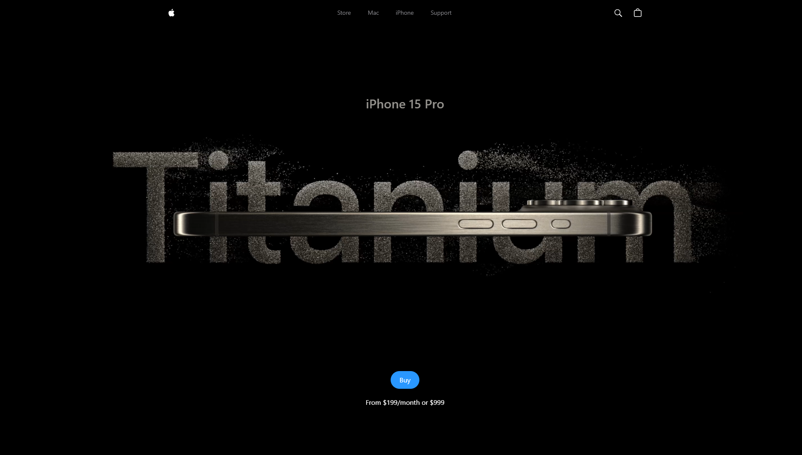

# iPhone 15 Pro Max Showcase 🎉📱



## Project Overview 🌟

Welcome to the **iPhone 15 Pro Max Showcase**! This project is a **3D interactive experience** built using **React**, **Three.js**, and **GSAP** for animations. It offers an immersive way to explore the new iPhone model from various angles and discover its features in a dynamic and engaging manner.

## Description 🛠️

Get ready to dive into a **detailed and interactive view** of the iPhone 15 Pro Max! This web application leverages modern web technologies to deliver smooth animations and stunning 3D rendering, making it easy and enjoyable to explore the latest iPhone. Whether you're a tech enthusiast or just curious, this site provides a unique way to experience its features.

## Tech Stack 🚀

- **React**: JavaScript library for building user interfaces.
- **Vite**: Next-generation frontend tooling for fast development.
- **Three.js**: A powerful library for creating and displaying animated 3D graphics.
- **GSAP**: GreenSock Animation Platform for smooth, high-performance animations.
- **Tailwind CSS**: Utility-first CSS framework for rapidly building custom designs.

## Steps to Run the Project 🖥️

1. **Clone the Repository**:

    ```bash
    git clone https://github.com/yourusername/iphone-15-pro-max-showcase.git
    ```

2. **Navigate to the Project Directory**:

    ```bash
    cd iphone-15-pro-max-showcase
    ```

3. **Install Dependencies**:

    ```bash
    npm install
    ```

4. **Run the Development Server**:

    ```bash
    npm run dev
    ```

5. **Build for Production**:

    To create an optimized production build:

    ```bash
    npm run build
    ```

6. **Preview the Production Build**:

    Preview the production build locally with:

    ```bash
    npm run preview
    ```

7. **Deploy to Your Favorite Hosting Service**.

## Key Dependencies 🔧

- **React**: `npm install react react-dom`
- **Three.js**: `npm install three`
- **GSAP**: `npm install gsap`
- **Tailwind CSS**: `npm install tailwindcss`

## Live Website 🌐

Check out the live version of the site [here](https://your-live-website-link.com).

## Contributing 🤝

We welcome contributions! Please fork the repository and use a feature branch for your changes. Submit a pull request to contribute.

## License 📜

This project is licensed under the MIT License - see the [LICENSE](./LICENSE) file for details.

---

*Explore the iPhone 15 Pro Max like never before! 🚀📲*

